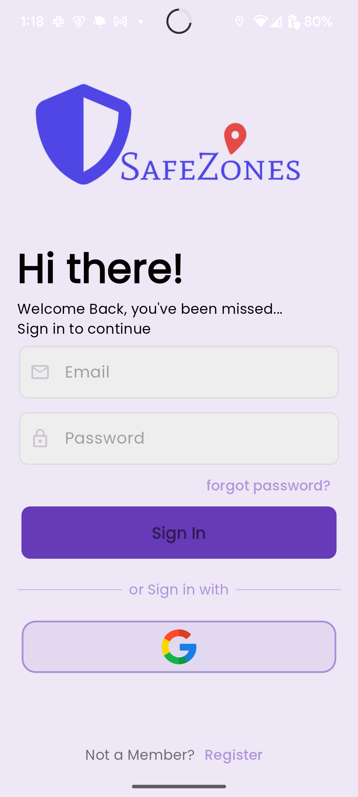
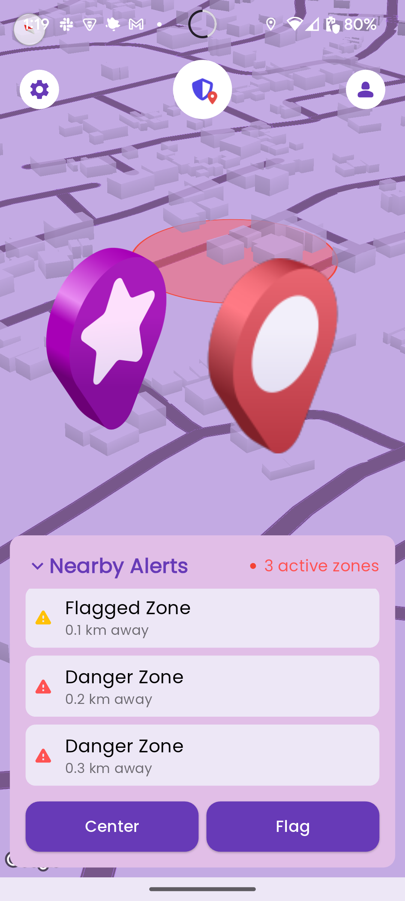
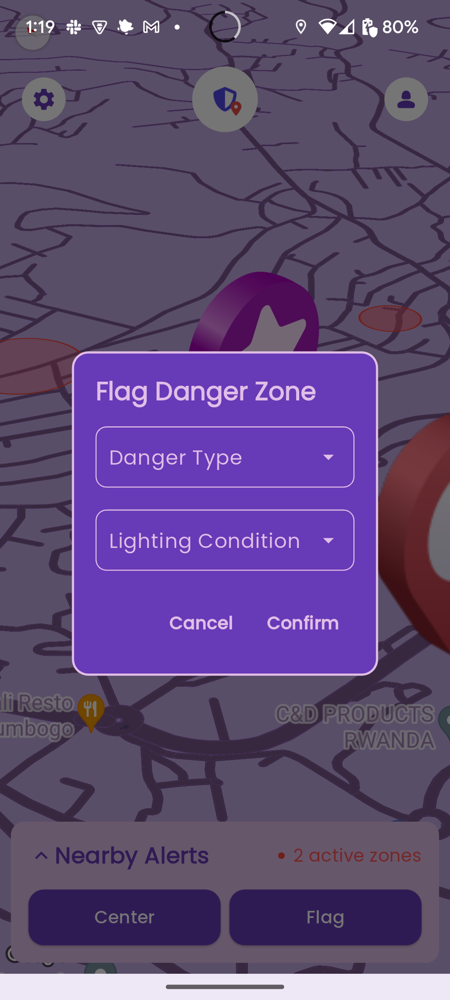
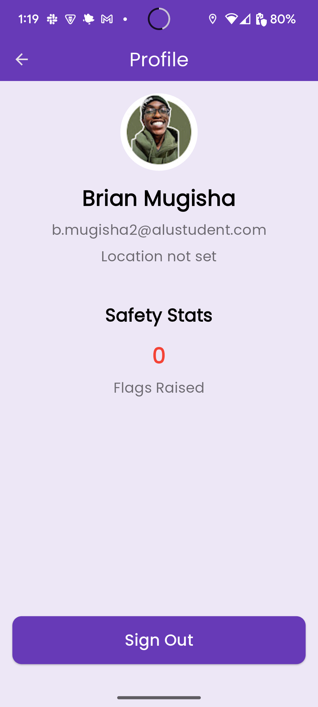
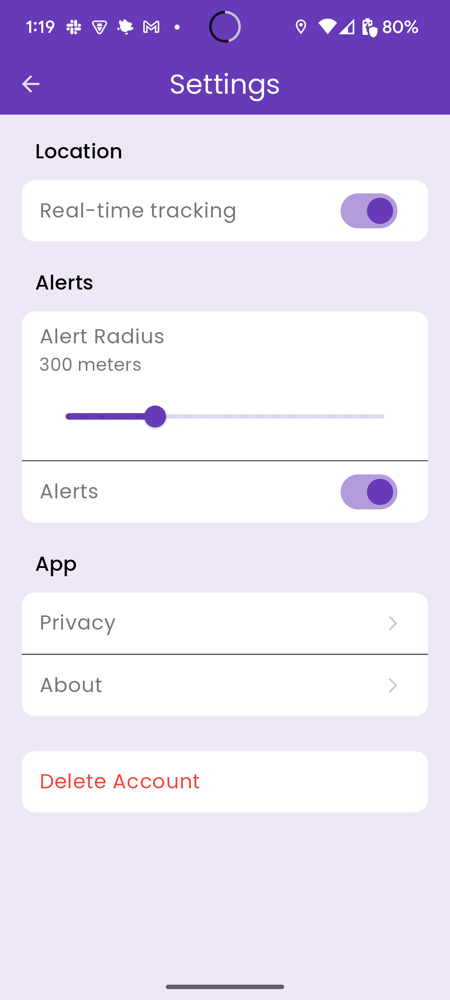

# SafeZones
The primary objective of this project is to develop a mobile application, SafeZones, that enhances public safety by providing real-time alerts about dangerous locations. The app will use GPS and AI-driven predictive models to deliver timely notifications and optimize safety for users.<br>







[Link to video](https://drive.google.com/file/d/148bTnqBxP98kSioGt8Jdu51pBKAqMkOi/view?usp=drive_link) <br>
[Link to Apk](https://drive.google.com/file/d/1kMU1M_m9CPdgExdhUHl5rOtPZJGmRFV4/view?usp=drive_link) <br>
To run the project:
Install required dependencies and run the project:
```
flutter pub get
flutter run
# then select your device
```

To build your own version just type: flutter build in the terminal, after cloning the repo.

A few resources to get you started if this is your first Flutter project:

- [Lab: Write your first Flutter app](https://docs.flutter.dev/get-started/codelab)
- [Cookbook: Useful Flutter samples](https://docs.flutter.dev/cookbook)

For help getting started with Flutter development, view the
[online documentation](https://docs.flutter.dev/), which offers tutorials,
samples, guidance on mobile development, and a full API reference.
